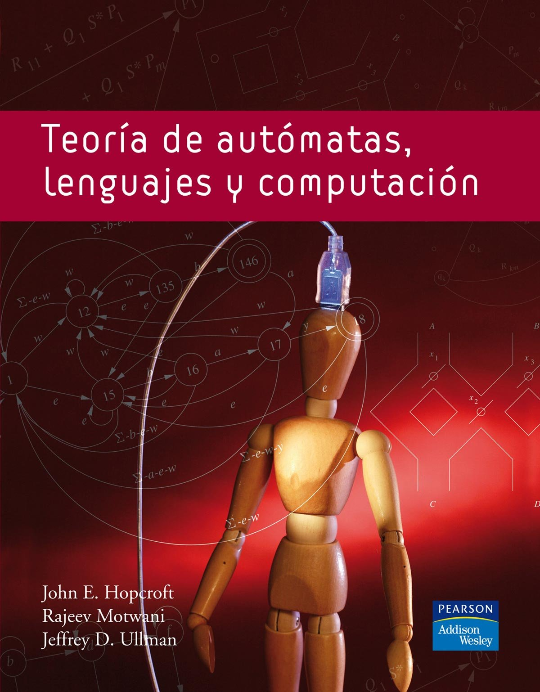
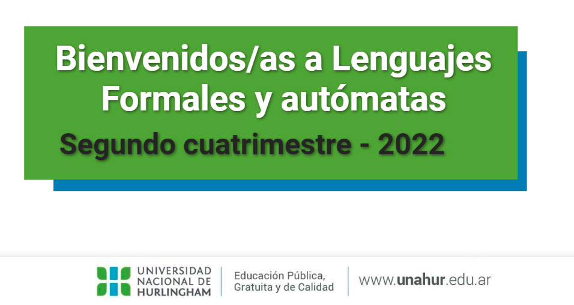
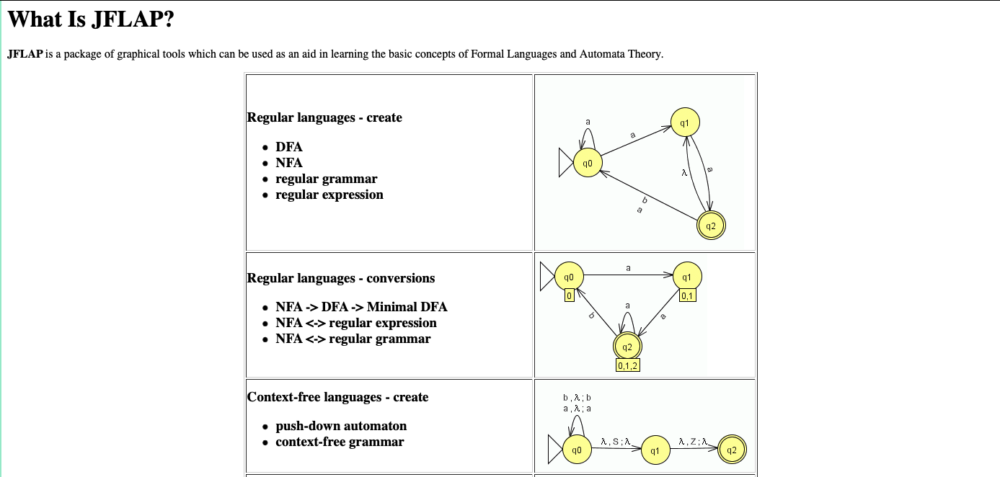

# Lenguajes Formales y Autómatas

* Instituto: Tecnología e Ingeniería
* Carrera: Licenciatura en Informática
* Año: 4
* Cuatrimestre: 2do.
* Carga horara semanal: 4 horas

## Fundamentación

* Fundamentos teóricos formales para el entendimiento de los compiladores y lenguajes de programación (tareas de reconocimiento de los elementos del lenguaje y su análisis sintáctico)

## Programa

1. Lenguajes formales (L, w, ó, Σ)
1. Gramáticas formales (GR, GIC, GDC, GI y Formas Normales: FNC, FNG y FNB)
1. Lenguajes Regulares (ER, AFD, AFN, Algoritmos. Lema de Bombeo)
1. Lenguajes Independientes de Contexto (GIC, AP)
1. Máquina de Turing (Unicinta, multicinta y MTND)

## Primera clase

1. **Presentación de la materia** (Fundamentación + Programa + Cronograma)

    ---

1. **Bibliografía**
    

    ---

1. **Campus:**
    
    * La materia se ofreció a intercambio internacionales, estuve trabajando con el Equipo de Tecnología Educativa (Tamara Olmedo y Julieta Sprejer en junio/julio 2022) para virtualizar la materia.
    * Diseño del campus: dividido por unidades.
    * **Encuadre general**: Se realiza una presentación de la asignatura, se anticipan las formas de acreditación. En este solapa se comparte el programa y una presentación gráfica de la materia.
    * **Cada unidad del aula virtual está compuesta por clases**. Cada una de éstas consta de los siguientes componentes: introducción a la unidad, video donde se exponen los temas de cada clase, recursos para el aprendizaje (infografía), actividades, pizarras de clase, y espacio de tutoría.

    ---

1. Software JFlap, para experimentar con los temas de la materia.
    [JFLAP](https://www.jflap.org)

    

    ---

1. Metodología de enseñanza:
    * **Teoría**: se presentan los contenidos teóricos con ejemplos.
    * **Práctica**: se resuelven ejercicios y se atienden dudas.
    * **Actividades Prácticas**: resolución de problemas.
    * **Simulacro de parcial**: clase previa a cada evaluación.

    ---

1. Evaluación:
    * Dos parciales teóricos - prácticos, donde tienen que diseñar gramáticas y máquinas, analizar funcionamiento de las máquinas, etc.
    * Recuperatorios de ambos parciales.

    ---
